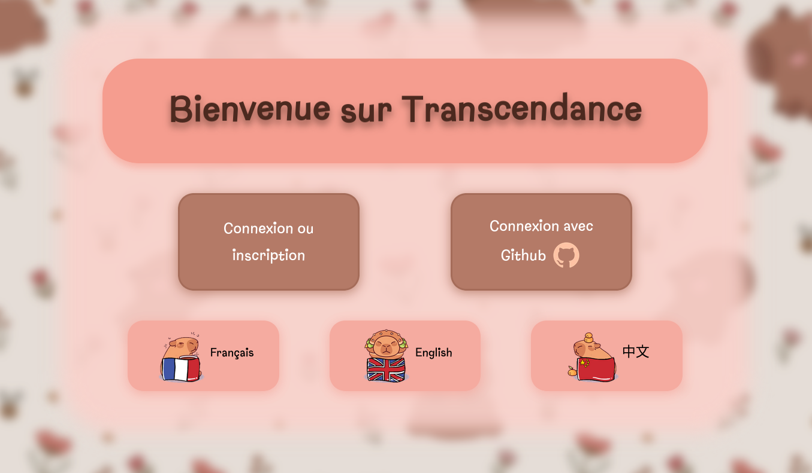
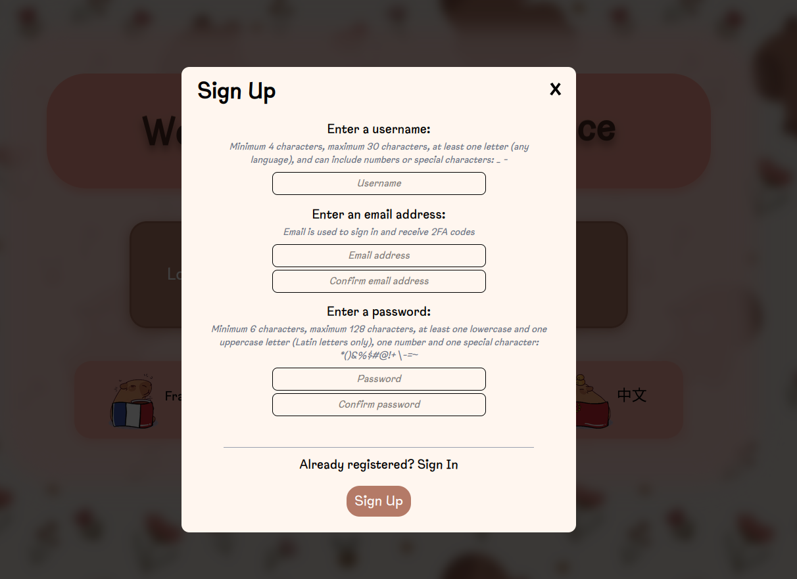
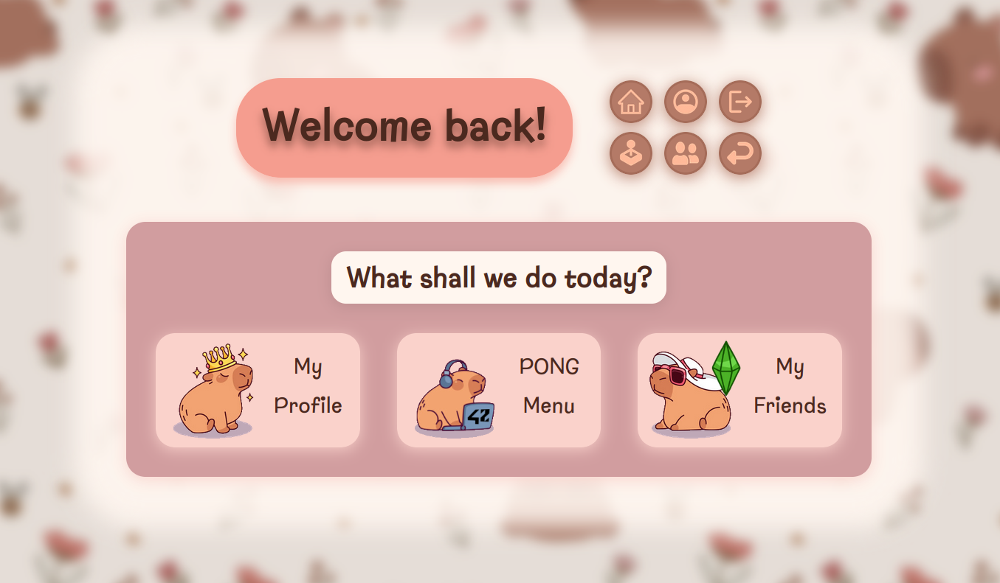
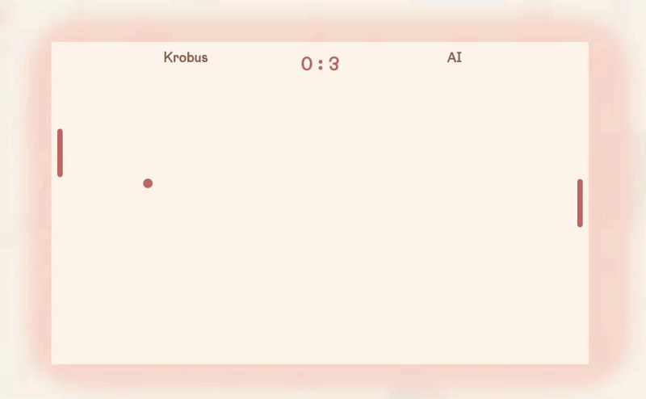
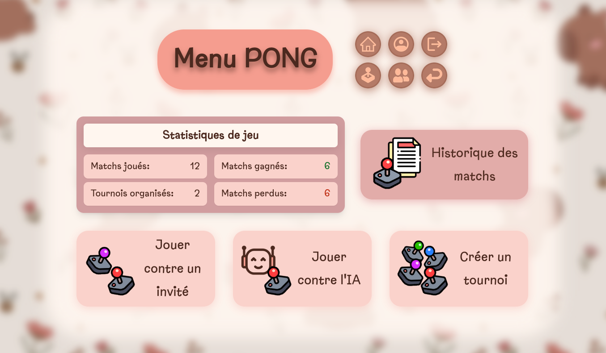
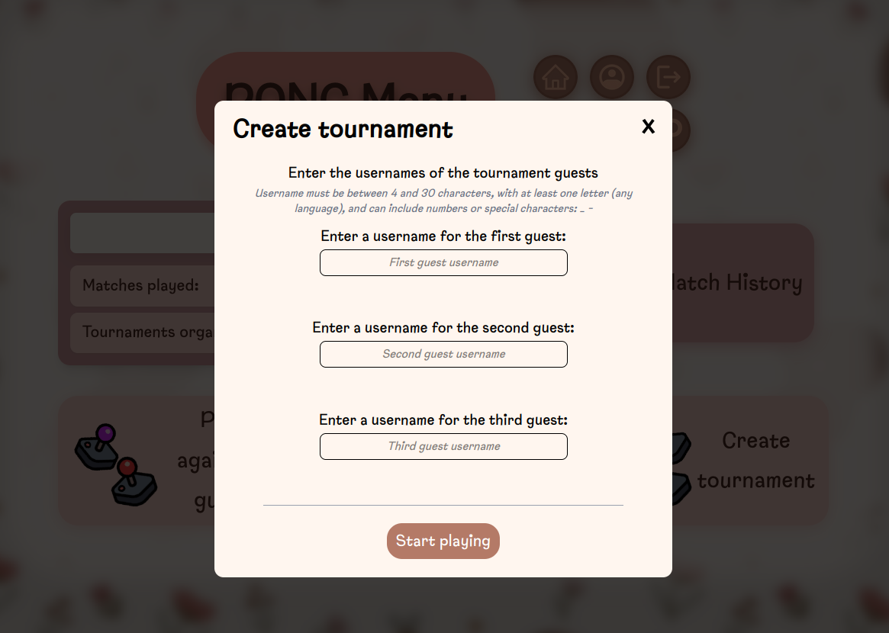
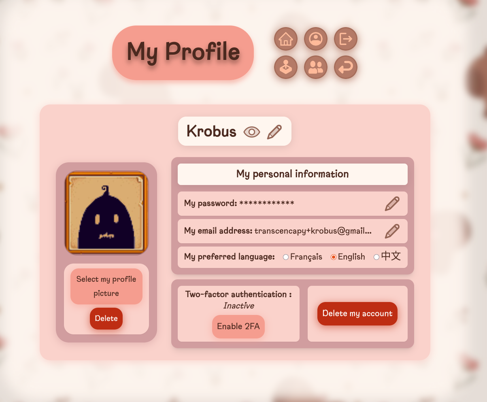
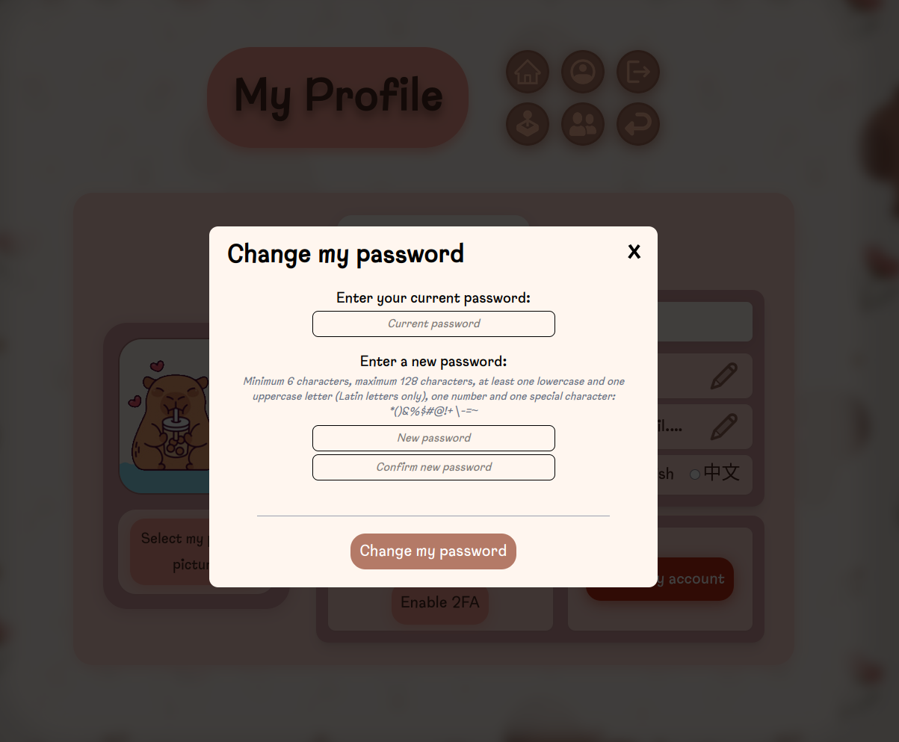
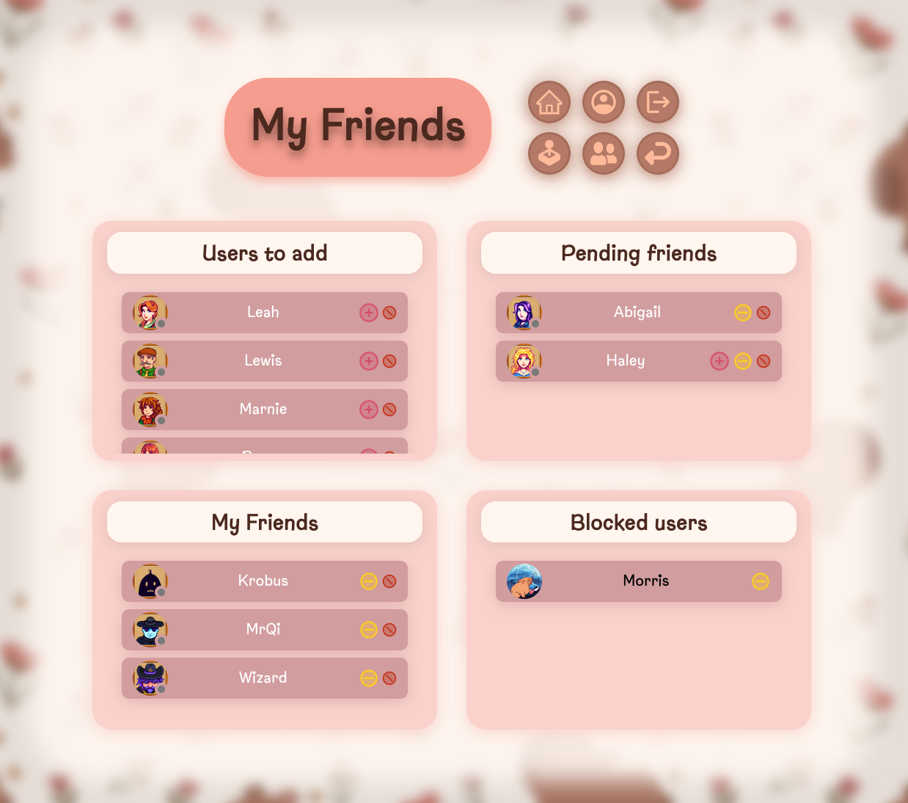
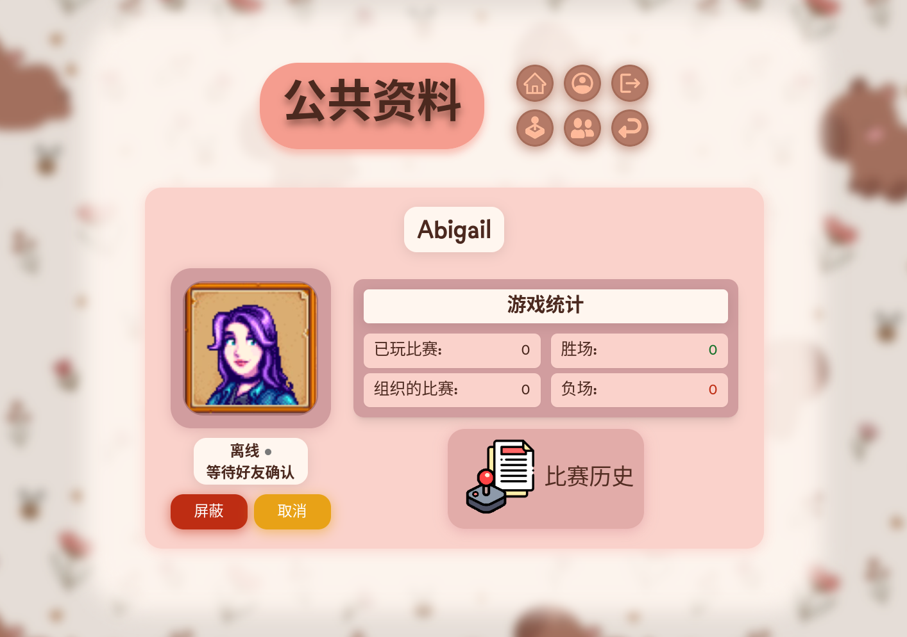

🇫🇷 Version française disponible [ici](README_FR.md)

---


# Project presentation - `transcendance`
**Introduction**

*This project was realized in a **duo with [Bibickette](https://github.com/bibickette)***

This README is organized as follows:

- [Description](#description)

- [Languages & Technologies](#languages--technologies)
  - [Languages](#languages)
  - [Technologies](#technologies)

- [Key Concepts](#key-concepts)

- [Features](#features)

- [Screenshots](#screenshots)
  - [Home & Authentication](#-home--authentication)
  - [Home when logged in](#-home-when-logged-in)
  - [Pong Menu & Gameplay](#-pong-menu--gameplay)
  - [Navigation & Real-Time Status](#-navigation--real-time-status)
  - [User Management](#-user-management)
  - [Friends & Public Profile](#-friends--public-profile)
  - [Assets & Credits](#assets--credits)

- [System Environment](#system-environment)
  - [Container Base](#container-base)
  - [Frontend Environment](#frontend-environment)
  - [Security](#security)
  - [Data Persistence](#data-persistence)

- [Project Structure](#project-structure)
  - [Environment Variables](#environment-variables)

- [Database Access](#database-access)

- [Using transcendance](#using-transcendance)
  - [Makefile rules](#makefile-rules)
  - [How to use transcendance](#how-to-use-transcendance)


---


## Description
Transcendance is a **full-stack** **Single Page Application** (SPA) built entirely in **TypeScript**. It is designed to provide a **secure**, **real-time multiplayer experience** and **dynamic user interaction**, combining modern web technologies and containerized deployment.

The main goals of the project are:
- Real-time gameplay : classic **Pong**, player vs player or vs AI.
- Secure user authentication with **JWT**, optional **2FA** and **remote authentication**.
- Dynamic user interaction : online presence and requests in friends list with **WebSockets**.
- Full-stack SPA : tightly integrated backend and frontend.
- Multi-language (EN, FR, CN) support via a **homemade dictionary (i18n)** accessible across the website.
- Secure and containerized environment with **HTTPS/TLS**, SSL certificates, and isolated Docker services.

This project demonstrates best practices in **web security**, authentication, real-time communication, and container orchestration.

* * *
## Languages & Technologies

### Languages
1. **TypeScript** : Full-stack language used in both backend (Fastify server) and frontend SPA. Provides static typing for safer, maintainable code.
2. **HTML** : Markup language for structuring frontend pages.
3. **JSON** : Data format used for API requests/responses, configuration, and storing structured data like dictionaries or game state.
4. **CSS** : Styling for frontend, implemented via **TailwindCSS**, a modern utility-first framework.


### Technologies
**Backend**

1. **Fastify** : Node.js framework used as the backend. Handles routing, REST APIs, authentication, and WebSockets.
2. **SQLite** : Lightweight relational database storing users’ information, game stats, and the global dictionary.
3. Authentication modules :
    - **JWT & 2FA** : Standard login workflow:  
        - User logs in with email/password (hashed in database).  
        - Backend issues a JWT token for session management.  
        - If enabled, 2FA is required to complete login.  
    - **Remote Authentication** : Users can log in via external providers (e.g., GitHub). Backend issues a JWT token after successful remote login.
4. **WebSocket server** : Real-time updates for:  
    - Friends online/offline status
    - Incoming friend requests

**Frontend**
1. **Vanilla TypeScript SPA** : Handles all client-side logic.
2. **TailwindCSS** : Modern utility-first CSS framework for styling.
3. **Vite** : Development server with fast hot reload.

**Infrastructure**
1. **Docker & Docker Compose** : Containerized dev and production environments.
2. **NGINX** : Reverse proxy in production with SSL/TLS for secure HTTPS connections.
3. **Container networking** : Ensures isolated and secure communication between services.

* * *
## Key Concepts

1. **Full-stack SPA** : Single-page application powered by a secure backend and a dynamic frontend.
2. **Real-time communication** : WebSockets for online presence, game events, and live notifications.
3. **Authentication & Security** : Secure login system including:  
    - Local login with hashed passwords, JWT sessions, and optional 2FA
    - Remote authentication via external providers (GitHub OAuth)
    - HTTPS/TLS enforced everywhere
4. **Gameplay Mechanics** : Classic Pong with AI or multiplayer mode, including tournament matches.
5. **Database Management** : SQLite for persistent storage of users informations.
6. **Multi-language support** : Dictionary system enables multiple languages across the website.
7. **Containerized Deployment** : Docker ensures consistency, reproducibility, and isolated services.
8. **Frontend Styling** : Responsive, modern UI with TailwindCSS.

* * *
## Features
**Authentication**
- JWT-based sessions with hashed passwords.
- Optional 2FA for extra security.
- Remote authentication (OAuth) with Github.

**User Management**
- Register, login, and manage users.
- Friends list with real-time online/offline status via WebSocket.
- Receive friends requests in real-time.

**Gameplay**
- Classic Pong: Player vs Player or AI opponent
- Tournament mode: compete in structured matches
- Game history tracking and statistics

**Frontend**
- SPA built with Vanilla TypeScript.
- TailwindCSS styling.
- Hot reload for development via Vite.

**Security & Persistence**
- HTTPS/TLS enforced in both development and production.
- Secrets and environment variables stored securely.
- Docker volumes persist user-uploaded images and SQLite database.

* * *
## Screenshots

#### 🏠 Home & Authentication 
<p align="center">
  
</p>

<p align="center">
  
  
</p>


#### 🏠 Home when logged in

<p align="center">
  
</p>

#### 🏓 Pong Menu & Gameplay

<p align="center">
  
</p>
<p align="center">
  
</p>

<p align="center">
  
  
</p>

#### 🧭 Navigation & Real-Time Status

<p align="center">
  
  

</p>


#### 👤 User Management

<p align="center">
  
  
</p>

#### 👥 Friends & Public Profile


<p align="center">
  
  
</p>


### Assets & Credits

Some visual assets were adapted from publicly available online resources and modified to fit the needs of this project.

*This project is strictly for educational and non-commercial purposes.*

* * *
## System Environment

The Transcendance project is fully containerized using **Docker** and orchestrated with **Docker Compose**. Both **development** and **production** environments are designed to be **secure**, **reproducible**, and **convenient** for development.

### Container Base
**Base Image** : `node:20-bullseye`  
**Runtime** : Docker  
**Orchestration** : Docker Compose

### Frontend Environment
1. **Development Server** : Vite dev server over HTTPS.
    - Shared volume for immediate frontend edits in the container.
    - Live reloading for fast development.

2. **Production Server** : NGINX reverse proxy serving the SPA over HTTPS.
    - Most files live inside the container for isolation.
    - Persistent folders (user profile pictures, SQLite database) mounted as shared volumes.

### Security
- HTTPS is enforced in both development and production.
- Certificates are automatically handled inside the containers.
- All sensitive files, passwords, and tokens are stored securely and never exposed in the repository.

### Data Persistence
1. Shared volumes allow safe persistence of :
    - User-uploaded images
    - SQLite database
2. Other files are isolated in the container to avoid accidental modification or leakage.

* * *
## Project Structure

```
transcendance/
│
├── backend/
│   ├── Dockerfile       
│   ├── .env				# environment variables
│   ├── src/
|   ├── data_db/               
│   └── uploads/            
│
├── config/certs                
|
├── frontend/              
│   ├── Dockerfile 
│   ├── src/
│   ├── assets/
│   └── config/				
│
├── logs/
│
├── docker-compose.yml
├── Makefile
└── README.md
```

* * *
### Environment Variables
The project uses a `.env` file located in `packages/backend/` to configure environment variables.

⚠️ The real `.env` file **should not** be committed.

Below is a generic example for demonstration purposes:
```
# OAuth GitHub
GITHUB_CLIENT_ID=your_github_client_id
GITHUB_CLIENT_SECRET=your_github_client_secret
GITHUB_URL=https://github.com/
GITHUB_API=https://api.github.com/

# JWT
JWT_SECRET=change_me_in_production

# Development only, never use in production
UNIVERSAL_PASSWORD=dev_password_only
FAKE_PASSWORD=fake_password_for_testing

# Email Service
GMAIL_APP_PASSWORD=your_gmail_app_password

# URL du frontend
# In development : https://localhost:5173/
# In production : https://localhost:8443/
LOCALHOST=https://localhost:5173/
```

* * *
## Database Access

List of command to manually **inspect the SQLite database** :

1. Open SQLite shell : `sqlite3 ./packages/backend/data_db/database.sqlite`
2. List tables : `.tables`
3. Show users : `SELECT * FROM users;`
4. Exit SQLite and container : `.exit`


* * *
# Using `transcendance`
## Makefile rules
**🚀 Environment Startup**

1. **all** as *default rule* : Displays a message prompting you to choose between ***make dev*** or ***make prod***.
2. **dev** : Build and start the development environment using Docker Compose (with shared volumes and Vite dev server).
3. **prod** : Build and start the production environment using Docker Compose (NGINX reverse proxy + optimized build).

**🛠 Setup & Initialization**

4. **create** : *create_db*, *create_certs* and *create_logs* rules.
5. **create_db** : Creates `data_db/` (database directory) and `uploads/users/`(users avatar directory).
6. **create_certs** : Creates `config/certs/` (SSL certificates directory).
7. **create_logs** : Creates `logs/` (logs directory).

**🧹 Cleaning**

8. **clean** : *clean_db*, *clean_certs* and *clean_logs* rules.
9. **clean_db** : Removes `data_db/` (database directory) and `uploads/users/`(users avatar directory).
10. **clean_certs** : Removes `config/certs/` (SSL certificates directory).
11. **clean_logs** : Removes `logs/` (logs directory).

**🔄 Full Reset**

12. **fclean_dev** : Stops containers, removes volumes, and deletes Docker images tagged `:dev`.
13. **fclean_prod** : Stops containers, removes volumes, and deletes Docker images tagged `:prod`.
14. **re_dev** : *fclean_dev* and *dev* rules.
15. **re_prod** : *fclean_prod* and *prod* rules.

**🐳 Container Management**

16. **stop** : Stops running containers without removing them.
17. **down** : Stops and removes containers, networks, and associated resources.
18. **status** : Displays running containers, Docker images, Networks and Volumes.
19. **help** : Displays the Makefile command list.

* * *

## How to use `transcendance`

1. Clone `transcendance` in a folder first  : `git clone https://github.com/Naphiye/transcendance.git`
2. Go to the `transcendance/packages/backend` folder then create an environment file (`.env`) (*see [environment variables](#environment-variables) and [project structure](#project-structure) for more details*)

### 🛠 Development Mode
*⚠️ If you want to switch between development and production modes, you must clean the database first.*

3. Go to the `transcendance/` folder then build and start the infrastructure with `make dev`  
4. You can now access the website with `https://localhost:5173/`

**OR**
### 🚀 Production Mode
*⚠️ If switching from development mode, clean the database beforehand.*

3. Go to the `transcendance/` folder then build and start the infrastructure with `make prod`  
4. You can now access the website with `https://localhost:8443/`

* * *
*Project validation date : December 12, 2025*
